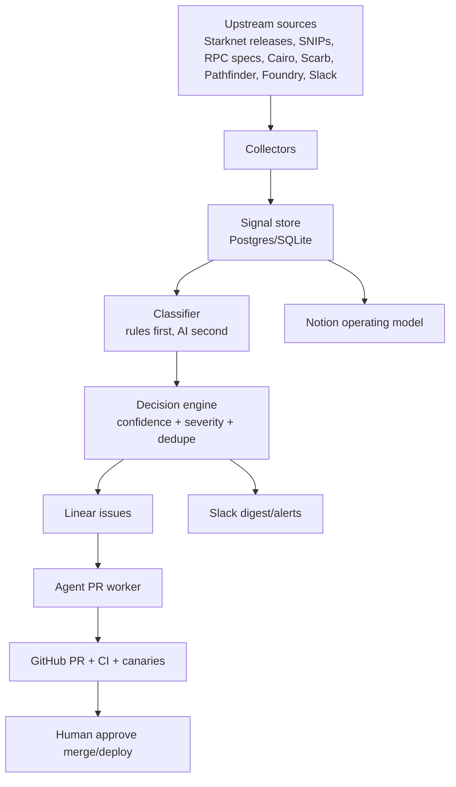

# Brewery

Brewery is a maintenance control plane for Starknet infrastructure.

Its job is to replace external Pathfinder and Scarb maintenance with a system
that watches upstream causes, turns them into Linear work, coordinates humans
and agents in Slack, and proves changes through GitHub, CI, and canaries.

As of May 2, 2026, Brewery should not be a chatbot. It should be deterministic
monitoring plus explicit human approval gates.



## MVP Scope

The first milestone is watch-only:

- Run daily.
- Watch official upstream sources and allowlisted Slack channels.
- Classify signals with deterministic rules first.
- Create or update Linear issues only for actionable or urgent signals.
- Post one daily Slack brief.
- Do not auto-reply externally.
- Do not auto-open, merge, or deploy PRs yet.

## Repository Shape

```text
brewery/
  sources/
    starknet.yaml
    cairo.yaml
    scarb.yaml
    pathfinder.yaml
    mezcal.yaml
  src/
    classifier/
      rules.js
      rules.test.js
  scripts/
    classify-sample.js
  state/
    schema.sql
  docs/
    operating-model.md
    boss-brief.md
  .github/workflows/
    daily-brief.yml
```

## Local Commands

This repo currently has no runtime dependencies.

```bash
npm test
npm run classify:sample
```

## Design Rule

Brewery should be:

```text
Deterministic monitoring
+ AI summarization
+ Linear memory
+ Slack coordination
+ agent PR execution
+ human-controlled risk gates
```

Agents can do the labor, but Brewery owns evidence, permissions, source
hierarchy, and approval boundaries.
